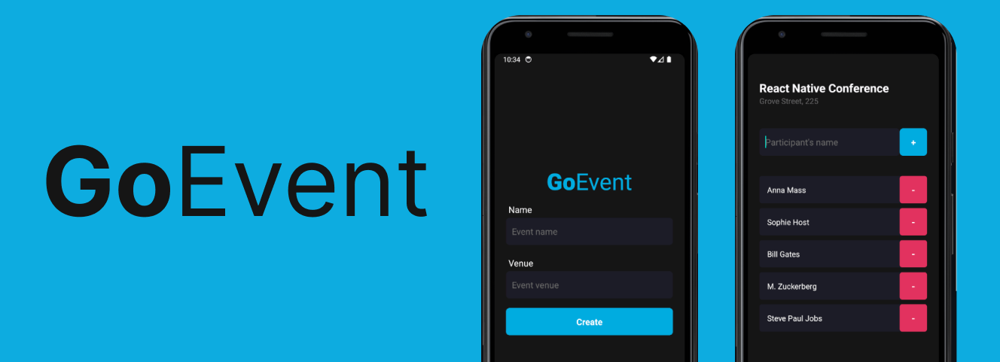

### 📚 Technologies


---

### Prerequisites
- NodeJS
- npm
- Android emulator

<a href="https://snack.expo.dev/@cesarcanoff/b34e26">See on the web</a>

<details>
  <summary>Simple Installation</summary>

  #### Clone the repository
```bash (SSH)
git clone git@github.com:CesarCanoff/event-go-mobile-app.git
```

#### Go to directory
```bash (SSH)
cd event-go-mobile-app
```

#### Install all dependencies
```bash (SSH)
npm install
```

#### Run the app
```bash (SSH)
npx expo start
```
  
</details>

